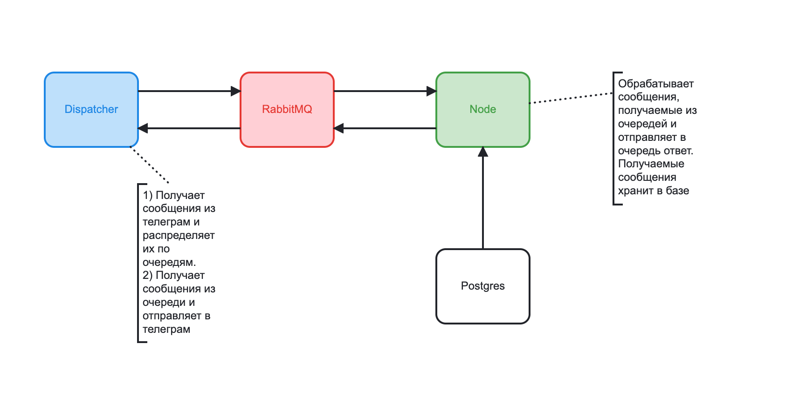

# Телеграм бот FirstBot

Проект построен с использованием MSA (Micro Service Architecture) и представляет собой фалообменник. Можно загрузить изображение на одном устройстве и затем получить на другом.

<b>Dispatcher</b> написан на Go. <b>Node</b> с использованием Kotlin/Spring.

### Структурная схема бота


### Подготовка проекта для запуска

1. Скачиваем проект https://github.com/krancheg/FirstBot.git
2. Регистрируем новый бот в телеграм чрез https://t.me/BotFather, выполняем команду /newbot, далее следуем инструкциям. 
В конец копируем access token.
3. Создаем в корне скаченного проекта файл `token.secret` и вставляем туда access token.
4. Переходим в каталог проекта

### Запуск проекта для *nix систем (Linux, MacOS)

1. ```chmod +x startBuild```
2. ```./startBuild```

### Запуск проекта для Windows

1. Собрать проект FirstBot вручную, сгенерировать jar для Node
2. ```docker-compose build```
3. ```docker-compose up```

### Deploy в Kubernetes
Развертывание микросервисов осуществляется с помощью Helm.
Перед началом необходимо создать файл `helm/dispatcher/templates/secret.yaml` 
с содержимым:
```
apiVersion: v1
kind: Secret
metadata:
  name: {{ .Values.secretName }}
  namespace: {{ .Values.namespace }}
type: Opaque
stringData:
  telegramToken: <access token>
```

### Как использовать
На данный момент доступны команды:
- /help - выдает информацию о боте, командах
- /get_номер - получает файл по номеру

Для загрузки изображений и документов используются страндартные средства телеграм